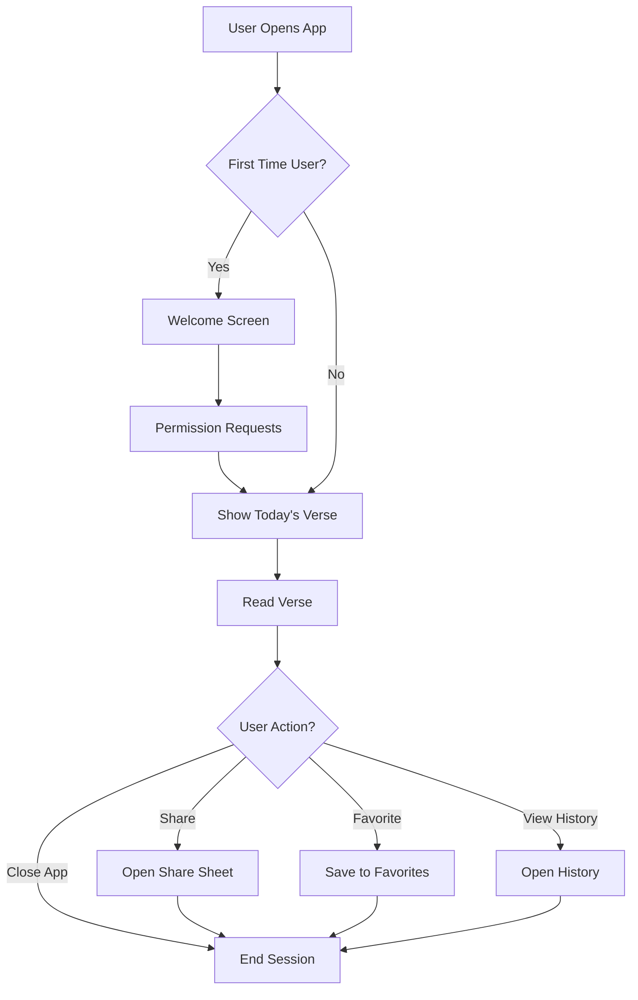
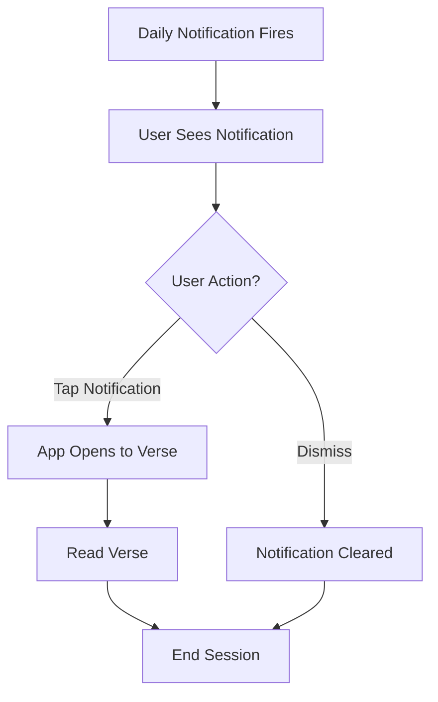
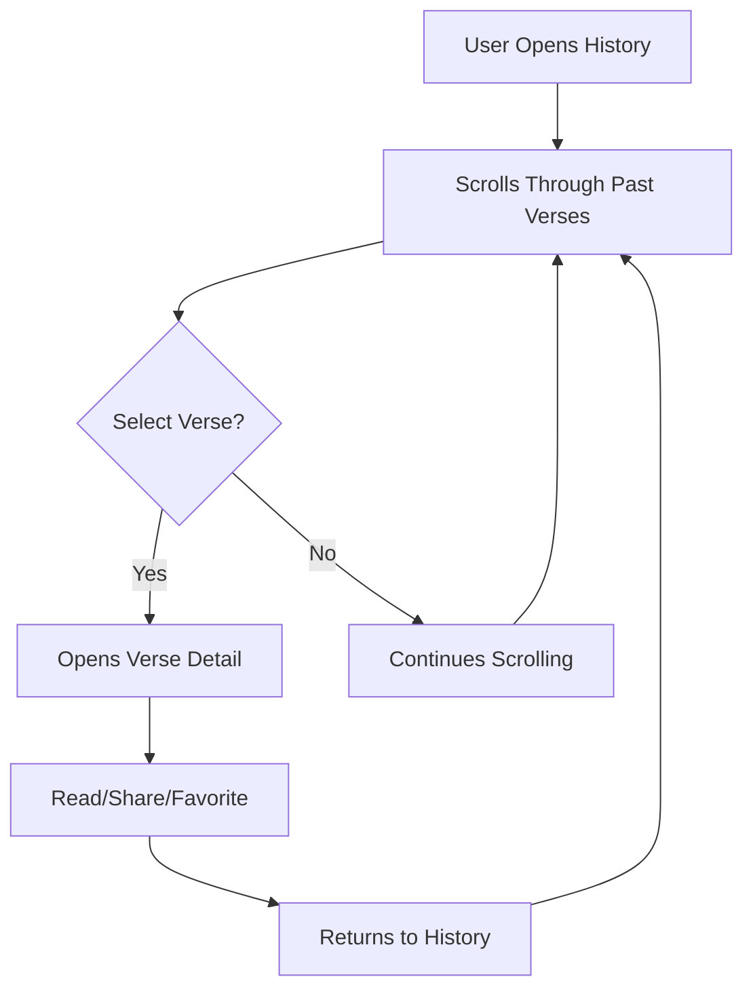
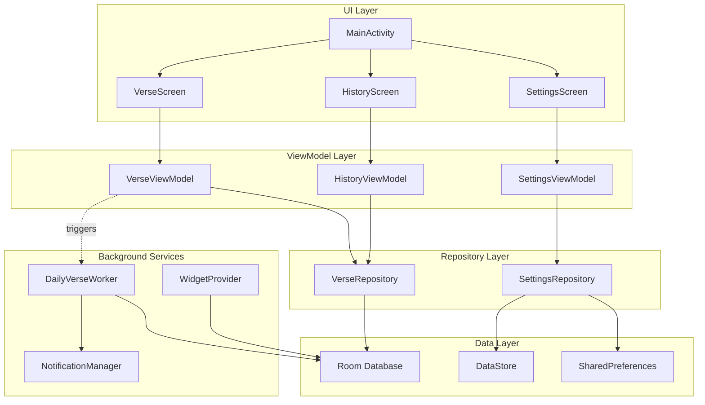

# PureWords1611 - App Concept & Feature Definition

**Document Version**: 1.0  
**Last Updated**: December 24, 2024  
**Status**: Initial Concept Approved

---

## 📋 Executive Summary

**PureWords1611** is a mobile Android application that delivers daily Bible verses from the authentic 1611 King James Version to users seeking spiritual growth and daily scripture engagement. The app addresses the need for convenient, reliable access to God's Word in a distraction-free mobile environment.

### Vision Statement
> "To make the pure, unchanging Word of God from the 1611 KJV easily accessible to believers worldwide through a simple, beautiful, and reliable daily verse application."

### Primary Objective
Establish a strong presence on the Google Play Store with a high-quality, faith-based application that showcases expertise in Android development while serving the spiritual needs of the Christian community.

### Success Criteria
- Successfully publish to Google Play Store by March 2026
- Achieve 1,000+ downloads within first 3 months
- Maintain 4.0+ star rating
- Zero privacy/security violations
- Daily active user engagement rate of 40%+

---

## 👥 Target Audience & User Demographics

### Primary User Personas

#### 1. **Daily Devotional David** (45% of target audience)
- **Age**: 35-65
- **Tech Savvy**: Moderate
- **Motivation**: Seeking consistent daily Bible reading habit
- **Usage Pattern**: Morning routine (7-9 AM) or evening (8-10 PM)
- **Pain Points**: Forgets to read Bible daily, finds full Bible apps overwhelming
- **Goals**: Simple, consistent access to scripture without distractions

#### 2. **Social Sharer Sarah** (30% of target audience)
- **Age**: 25-45
- **Tech Savvy**: High
- **Motivation**: Wants to share faith and encourage others
- **Usage Pattern**: Throughout day, shares verses on social media
- **Pain Points**: Needs easy sharing functionality, attractive verse presentations
- **Goals**: Inspire others with meaningful scripture passages

#### 3. **Traditional Tom** (15% of target audience)
- **Age**: 55+
- **Tech Savvy**: Low to Moderate
- **Motivation**: Prefers KJV specifically, values traditional scripture
- **Usage Pattern**: Scheduled daily reading (usually morning)
- **Pain Points**: Most apps use modern translations, complicated interfaces
- **Goals**: Access authentic KJV text in simple, readable format

#### 4. **Scripture Student Sally** (10% of target audience)
- **Age**: 18-35
- **Tech Savvy**: High
- **Motivation**: Memorizing scripture, studying Word of God
- **Usage Pattern**: Multiple times daily, organized study sessions
- **Pain Points**: Needs organization, bookmarking, and review capabilities
- **Goals**: Build personal collection of meaningful verses for meditation

### Geographic Distribution
- **Primary**: United States (60%)
- **Secondary**: English-speaking countries (UK, Canada, Australia, etc.) (30%)
- **Tertiary**: International English readers (10%)

### Device Characteristics
- Android 5.0+ devices (targeting 99% of active devices)
- Screen sizes: Primarily phones (80%), tablets (20%)
- Connectivity: Mix of WiFi and mobile data users
- Storage: Minimal footprint required (<50MB)

---

## 🎯 Core App Concept

### The Problem We Solve

Many Christians desire to read the Bible daily but face several challenges:
1. **Overwhelm**: Full Bible apps with hundreds of features are intimidating
2. **Time Constraints**: Busy schedules make finding/choosing verses difficult
3. **Consistency**: Hard to maintain daily reading habit without prompts
4. **Translation Preference**: Difficulty finding quality apps featuring 1611 KJV
5. **Distractions**: Social media-style Bible apps detract from scripture itself

### Our Solution

PureWords1611 provides a **focused, distraction-free daily verse experience** that:
- Curates one meaningful KJV verse daily (decision fatigue eliminated)
- Delivers consistent daily content (habit formation support)
- Uses authentic 1611 KJV translation (traditional accuracy)
- Maintains clean, simple interface (scripture-focused design)
- Operates offline after initial download (always accessible)
- Requires no account or personal data (privacy-first approach)

### Unique Value Proposition

**"Pure scripture, pure experience - one powerful verse daily from the 1611 KJV"**

**Key Differentiators:**
1. **Exclusive 1611 KJV Focus**: Unlike multi-translation apps, we specialize in authentic KJV
2. **Radical Simplicity**: No social features, no gamification, no distractions
3. **Privacy-First**: Zero personal data collection, no accounts required
4. **Offline-Primary**: Works without internet after initial verse download
5. **Ad-Free Forever**: No monetization distracts from scripture experience

---

## ✨ Complete Feature List

### Feature Prioritization Framework

Features are categorized using MoSCoW method:
- **Must-Have (M)**: Core MVP features, non-negotiable for v1.0
- **Should-Have (S)**: Important features for v1.1-1.2
- **Could-Have (C)**: Nice-to-have features for v1.3+
- **Won't-Have (W)**: Explicitly out of scope

---

### MUST-HAVE Features (Version 1.0 - MVP)

#### 1. Daily Verse Display (Priority: Critical)
**User Story**: *"As a user, I want to see one Bible verse each day so I can easily engage with scripture daily."*

**Specifications**:
- Single verse displayed prominently on home screen
- Verse text in readable font (18-24pt default, adjustable)
- Book, chapter, verse reference displayed clearly
- New verse automatically appears at midnight (local time)
- Verse remains accessible throughout the day
- Loading state with placeholder text

**Technical Requirements**:
- Local database of 365+ curated verses
- Daily verse selection algorithm (sequential or themed)
- Caching for offline access
- Automatic midnight refresh logic

**Acceptance Criteria**:
- [ ] Verse changes daily at midnight
- [ ] Verse remains same throughout the day
- [ ] Works offline after initial setup
- [ ] Text is readable on all screen sizes
- [ ] Loads in <2 seconds on first open

---

#### 2. Offline Verse Access (Priority: Critical)
**User Story**: *"As a user, I want to access my daily verse without internet so I can read scripture anywhere."*

**Specifications**:
- All verses pre-packaged with app installation
- No internet required after initial app download
- Local SQLite database for verse storage
- Graceful handling of no-internet state

**Technical Requirements**:
- Room database implementation
- 365+ verses stored locally (approximately 50-100KB data)
- Efficient database queries
- No external API dependencies for core function

**Acceptance Criteria**:
- [ ] App functions 100% offline
- [ ] No "No Internet" errors for verse viewing
- [ ] Database size under 1MB
- [ ] Fast query performance (<100ms)

---

#### 3. Simple, Clean User Interface (Priority: Critical)
**User Story**: *"As a user, I want a distraction-free interface so I can focus on God's Word."*

**Specifications**:
- Minimalist home screen design
- Scripture as primary focus (80% of screen space)
- Material Design 3 components
- Consistent navigation patterns
- Clear typography hierarchy
- Responsive layout for all screen sizes

**Technical Requirements**:
- Material Design 3 implementation
- Jetpack Compose or XML layouts
- Responsive design system
- Accessibility compliance (TalkBack support)

**Acceptance Criteria**:
- [ ] Verse is immediately visible on app open
- [ ] No more than 3 navigation options visible
- [ ] Passes accessibility scanner
- [ ] Supports screen readers
- [ ] Works on phones and tablets

---

#### 4. Theme Support (Light/Dark) (Priority: High)
**User Story**: *"As a user, I want dark mode so I can read comfortably at night."*

**Specifications**:
- Light theme (default)
- Dark theme option
- System theme detection (Android 10+)
- Manual theme toggle in settings
- Smooth theme transitions

**Technical Requirements**:
- Material Design theme system
- SharedPreferences for theme storage
- Dynamic theme switching
- AMOLED-friendly dark colors

**Acceptance Criteria**:
- [ ] Both themes implemented
- [ ] Text readable in both themes (WCAG AA compliant)
- [ ] Theme persists across app restarts
- [ ] Follows system theme on Android 10+
- [ ] Manual override option available

---

#### 5. Share Verse Functionality (Priority: High)
**User Story**: *"As a user, I want to share verses with others so I can encourage friends and family."*

**Specifications**:
- Share button on verse screen
- Android share sheet integration
- Formatted text output (verse + reference)
- Share to: SMS, email, social media, messaging apps
- Optional: Image generation for social media

**Technical Requirements**:
- Android Intent.ACTION_SEND
- Text formatting for sharing
- Optional: Canvas API for image generation

**Acceptance Criteria**:
- [ ] Share button clearly visible
- [ ] Opens Android share sheet
- [ ] Verse text formatted properly
- [ ] Reference included in shared text
- [ ] Works with all major messaging/social apps

---

#### 6. Verse History (Last 30 Days) (Priority: High)
**User Story**: *"As a user, I want to review recent verses so I can reflect on previous days' scripture."*

**Specifications**:
- List view of past 30 days of verses
- Scroll through historical verses
- Tap verse to view full screen
- Date labels for each verse
- Smooth scrolling performance

**Technical Requirements**:
- RecyclerView or LazyColumn implementation
- Date formatting
- Database query for date range
- Efficient list rendering

**Acceptance Criteria**:
- [ ] Shows last 30 days of verses
- [ ] Sorted newest to oldest
- [ ] Smooth scrolling (60 fps)
- [ ] Dates formatted clearly
- [ ] Tapping opens verse detail view

---

#### 7. Basic Settings Screen (Priority: Medium)
**User Story**: *"As a user, I want to customize basic app settings so I can personalize my experience."*

**Specifications**:
- Settings accessible from main menu
- Theme selection (Light/Dark/System)
- Font size adjustment (Small/Medium/Large/Extra Large)
- About section (app version, credits)
- Privacy policy link

**Technical Requirements**:
- PreferenceScreen implementation or custom settings UI
- SharedPreferences for persistence
- Version info from BuildConfig

**Acceptance Criteria**:
- [ ] Settings screen accessible
- [ ] All settings persist
- [ ] Changes apply immediately
- [ ] About section shows version
- [ ] Privacy policy accessible

---

### SHOULD-HAVE Features (Version 1.1-1.2)

#### 8. Daily Notification Reminder (Priority: Medium)
**User Story**: *"As a user, I want a daily reminder so I don't forget to read my verse."*

**Specifications**:
- Opt-in notification (disabled by default)
- User-selectable notification time
- Simple notification: "Your daily verse is ready"
- Tapping notification opens app to verse
- Android 13+ notification permission handling

**Technical Requirements**:
- WorkManager for reliable scheduling
- NotificationChannel setup
- AlarmManager for precise timing
- Boot receiver for notification persistence

**Acceptance Criteria**:
- [ ] Notification fires at set time daily
- [ ] Survives device reboot
- [ ] Opens app when tapped
- [ ] Can be disabled in settings
- [ ] Respects Do Not Disturb mode

---

#### 9. Favorite/Bookmark Verses (Priority: Medium)
**User Story**: *"As a user, I want to save favorite verses so I can quickly return to meaningful passages."*

**Specifications**:
- Heart/star icon on verse screen
- Toggle favorite status
- Favorites list view
- Unlimited favorites storage
- Sort favorites by date added or book order

**Technical Requirements**:
- Database table for favorites
- Many-to-many relationship or boolean flag
- CRUD operations for favorites
- Efficient favorites query

**Acceptance Criteria**:
- [ ] Can mark/unmark favorites
- [ ] Favorites persist across sessions
- [ ] Favorites list shows all saved verses
- [ ] Can remove from favorites list
- [ ] Visual indicator when verse is favorited

---

#### 10. Font Size Customization (Priority: Medium)
**User Story**: *"As a user, I want to adjust text size so I can read comfortably based on my vision needs."*

**Specifications**:
- 5 size options: XS, S, M, L, XL
- Preview before applying
- Applies to all verse text
- Respects system font size setting
- Accessible for vision-impaired users

**Technical Requirements**:
- Scalable text dimensions (sp units)
- Dynamic text sizing
- SharedPreferences storage

**Acceptance Criteria**:
- [ ] 5 distinct size options
- [ ] Text size changes immediately
- [ ] Persists across app restarts
- [ ] Readable at all sizes
- [ ] No layout breaking

---

#### 11. Widget Support (Home Screen Widget) (Priority: Medium)
**User Story**: *"As a user, I want a home screen widget so I can see the daily verse without opening the app."*

**Specifications**:
- Simple widget showing current verse
- 4x2 size (medium)
- Updates at midnight automatically
- Tapping widget opens app
- Theme matches system or app setting

**Technical Requirements**:
- AppWidgetProvider implementation
- RemoteViews for widget layout
- WorkManager for daily updates
- Widget update broadcast receiver

**Acceptance Criteria**:
- [ ] Widget available in widget picker
- [ ] Shows current daily verse
- [ ] Updates daily at midnight
- [ ] Opens app when tapped
- [ ] Readable text on widget

---

#### 12. Search Verses (Priority: Low-Medium)
**User Story**: *"As a user, I want to search verses by keyword so I can find specific topics."*

**Specifications**:
- Search bar in verse history or separate tab
- Full-text search of verse content
- Search by book name, keyword, or reference
- Results list with highlighting
- Fast search performance

**Technical Requirements**:
- FTS (Full-Text Search) in SQLite
- Search query optimization
- Result ranking by relevance

**Acceptance Criteria**:
- [ ] Search returns relevant results
- [ ] Results display within 500ms
- [ ] Keyword highlighting
- [ ] Handles typos gracefully
- [ ] "No results" state handled

---

### COULD-HAVE Features (Version 1.3+)

#### 13. Reading Streaks (Priority: Low)
**User Story**: *"As a user, I want to track my reading streak so I can stay motivated to read daily."*

**Specifications**:
- Counter showing consecutive days read
- Badge/icon showing current streak
- Congratulations on milestone streaks (7, 30, 100 days)
- Graceful "streak broken" messaging
- Historical streak records

**Technical Requirements**:
- Daily activity tracking in database
- Date calculation logic
- Local notifications for milestones

**Acceptance Criteria**:
- [ ] Accurate streak counting
- [ ] Persists across app sessions
- [ ] Visual streak indicator
- [ ] Milestone celebrations
- [ ] Does not feel like "guilt-tripping"

---

#### 14. Multiple Verse Collections/Plans (Priority: Low)
**User Story**: *"As a user, I want different verse collections (topical, book-based) so I can focus my reading."*

**Specifications**:
- Predefined collections: Comfort, Strength, Wisdom, Psalms, etc.
- User can select which collection for daily verses
- Switch between collections in settings
- Each collection has 30-365 verses

**Technical Requirements**:
- Database table for collections
- Collection metadata (name, description, verse list)
- Collection selection logic

**Acceptance Criteria**:
- [ ] 3-5 collections available
- [ ] User can switch collections
- [ ] Verses change based on collection
- [ ] Collection progress shown
- [ ] Can reset/start collection over

---

#### 15. Verse Image Generation (Social Media Ready) (Priority: Low)
**User Story**: *"As a user, I want to share beautiful verse images so my social media posts look professional."*

**Specifications**:
- Generate 1080x1080 image with verse text
- 2-3 template designs (elegant, modern, classic)
- Background images or solid colors
- Text overlay with good contrast
- Save to gallery or share directly

**Technical Requirements**:
- Android Canvas/Bitmap API
- Image templates (bundled as assets)
- Text rendering on images
- Storage permissions (Android 10+ scoped storage)

**Acceptance Criteria**:
- [ ] Generates shareable image
- [ ] Multiple template options
- [ ] Text readable on all templates
- [ ] Saves to gallery successfully
- [ ] Shares to social media

---

#### 16. Audio Verse (Text-to-Speech) (Priority: Low)
**User Story**: *"As a user, I want to hear the verse read aloud so I can listen while doing other tasks."*

**Specifications**:
- Play button on verse screen
- Android TTS (Text-to-Speech) integration
- Play/pause controls
- Volume controls
- Works with screen off (background playback)

**Technical Requirements**:
- TextToSpeech API
- Audio focus handling
- Notification controls during playback

**Acceptance Criteria**:
- [ ] Plays verse audio
- [ ] Clear pronunciation
- [ ] Play/pause functionality
- [ ] Works in background
- [ ] Stops when exiting app

---

#### 17. Multi-Language Support (Priority: Low)
**User Story**: *"As a non-English user, I want the app interface in my language so I can navigate easily."*

**Specifications**:
- UI translated to 3-5 languages: Spanish, Portuguese, French, German
- KJV text remains English (primary focus)
- Language selection in settings
- RTL support for future Arabic/Hebrew

**Technical Requirements**:
- Android string resources for localization
- Translated strings for UI elements
- Locale handling

**Acceptance Criteria**:
- [ ] UI elements translated
- [ ] Language persists
- [ ] No broken layouts
- [ ] Falls back to English gracefully

---

### WON'T-HAVE Features (Out of Scope)

These features are explicitly excluded to maintain focus:

❌ **User Accounts/Authentication** - Increases complexity, privacy concerns  
❌ **Social Network Features** - Distracts from scripture focus  
❌ **In-App Chat/Community** - Moderation burden, security risks  
❌ **Multiple Bible Translations** - Dilutes 1611 KJV specialization  
❌ **Full Bible Reader** - Different product, too complex  
❌ **Study Notes/Commentary** - Requires theological expertise, copyright issues  
❌ **Gamification (Points, Badges, Leaderboards)** - Trivializes scripture  
❌ **Advertisements** - Distracts from content, privacy concerns  
❌ **In-App Purchases** - Commitment to 100% free app  
❌ **Backup to Cloud** - No user accounts, privacy-first approach

---

## 🎨 User Experience & Design

### User Journey Flows

#### Primary Flow: Daily Verse Reading


#### Secondary Flow: Notification to App


#### Tertiary Flow: Browsing History


### Wireframe Concepts

#### Home Screen (Daily Verse)
```
┌─────────────────────────┐
│  ☰ PureWords1611    ⚙   │
├─────────────────────────┤
│                         │
│                         │
│   "The words of the     │
│   LORD are pure words:  │
│   as silver tried in    │
│   a furnace of earth,   │
│   purified seven        │
│   times."               │
│                         │
│   — Psalm 12:6 (KJV)    │
│                         │
│                         │
│   [♡ Favorite] [⎙ Share]│
│                         │
│   View History >        │
│                         │
└─────────────────────────┘
```

#### History Screen
```
┌─────────────────────────┐
│  ← Verse History        │
├─────────────────────────┤
│ 🔍 Search verses...     │
├─────────────────────────┤
│ Today - Dec 24          │
│ "The words of the       │
│ LORD..." — Psalm 12:6   │
├─────────────────────────┤
│ Yesterday - Dec 23      │
│ "Thy word is a lamp..." │
│ — Psalm 119:105         │
├─────────────────────────┤
│ Dec 22                  │
│ "For God so loved..."   │
│ — John 3:16             │
├─────────────────────────┤
│ Dec 21                  │
│ "I can do all things..."│
│ — Philippians 4:13      │
└─────────────────────────┘
```

### Design Principles

1. **Scripture First**: Verse text is always the primary visual element
2. **Minimalist**: Remove anything that doesn't serve the core purpose
3. **Accessible**: WCAG AA compliant, screen reader optimized
4. **Familiar**: Follow Android Material Design conventions
5. **Respectful**: Design honors the sacred nature of content

### Visual Design System

**Typography**:
- Primary Font: Noto Serif (serif for scripture readability)
- Secondary Font: Roboto (sans-serif for UI elements)
- Verse Text: 22sp (default), adjustable
- Reference Text: 14sp
- UI Text: 16sp

**Color Palette**:
- Light Theme:
  - Primary: #1565C0 (Deep Blue)
  - Background: #FFFFFF (White)
  - Surface: #F5F5F5 (Light Gray)
  - Text: #212121 (Near Black)
  - Accent: #C62828 (Deep Red)
  
- Dark Theme:
  - Primary: #90CAF9 (Light Blue)
  - Background: #121212 (True Black for AMOLED)
  - Surface: #1E1E1E (Dark Gray)
  - Text: #E0E0E0 (Light Gray)
  - Accent: #EF5350 (Light Red)

**Spacing**:
- Base Unit: 8dp
- Card Padding: 16dp
- Screen Margin: 16dp
- Element Spacing: 8dp, 16dp, 24dp

**Iconography**:
- Material Icons (standard)
- 24dp icon size (default)
- Clear, recognizable symbols

---

## 🏗️ Technical Architecture

### Technology Stack

**Language**: Kotlin 100%  
**Minimum SDK**: API 21 (Android 5.0 Lollipop) - 99% device coverage  
**Target SDK**: API 34 (Android 14) - Latest at time of development

**Architecture Pattern**: MVVM (Model-View-ViewModel)
- **Model**: Data layer (Room database, repositories)
- **View**: UI layer (Jetpack Compose or XML + ViewBinding)
- **ViewModel**: Business logic layer (LiveData/StateFlow)

### Key Libraries & Dependencies

**Core Framework**:
- AndroidX Core KTX
- AppCompat
- Material Components 3

**UI Layer**:
- Option A: Jetpack Compose (modern, declarative UI)
- Option B: XML Layouts + View Binding (traditional, stable)

**Data Layer**:
- Room (SQLite ORM)
- DataStore (SharedPreferences replacement)
- Kotlin Coroutines + Flow

**Dependency Injection**:
- Hilt (preferred) or Koin (lightweight alternative)

**Background Tasks**:
- WorkManager (reliable background scheduling)
- AlarmManager (precise notification timing)

**Testing**:
- JUnit 4/5 (unit tests)
- Mockito/MockK (mocking)
- Espresso (UI tests)
- Truth (assertions)

**Build Tools**:
- Gradle 8.x
- Kotlin 1.9+
- Android Gradle Plugin 8.x

### Database Schema

```sql
-- Verses Table
CREATE TABLE verses (
    id INTEGER PRIMARY KEY AUTOINCREMENT,
    book TEXT NOT NULL,
    chapter INTEGER NOT NULL,
    verse INTEGER NOT NULL,
    text TEXT NOT NULL,
    reference TEXT NOT NULL,
    date_assigned DATE,
    is_favorite BOOLEAN DEFAULT 0,
    date_favorited TIMESTAMP,
    created_at TIMESTAMP DEFAULT CURRENT_TIMESTAMP
);

-- Daily Verse History
CREATE TABLE daily_verse_history (
    id INTEGER PRIMARY KEY AUTOINCREMENT,
    verse_id INTEGER NOT NULL,
    display_date DATE NOT NULL,
    was_viewed BOOLEAN DEFAULT 0,
    view_timestamp TIMESTAMP,
    FOREIGN KEY (verse_id) REFERENCES verses(id),
    UNIQUE(display_date)
);

-- User Settings
CREATE TABLE user_settings (
    key TEXT PRIMARY KEY,
    value TEXT NOT NULL,
    updated_at TIMESTAMP DEFAULT CURRENT_TIMESTAMP
);

-- Reading Activity (for streaks)
CREATE TABLE reading_activity (
    activity_date DATE PRIMARY KEY,
    verses_read INTEGER DEFAULT 1,
    created_at TIMESTAMP DEFAULT CURRENT_TIMESTAMP
);
```

### App Architecture Diagram



### File Structure

```
app/
├── src/
│   ├── main/
│   │   ├── java/com/purewords1611/android/
│   │   │   ├── data/
│   │   │   │   ├── database/
│   │   │   │   │   ├── AppDatabase.kt
│   │   │   │   │   ├── dao/
│   │   │   │   │   │   ├── VerseDao.kt
│   │   │   │   │   │   └── HistoryDao.kt
│   │   │   │   │   └── entities/
│   │   │   │   │       ├── Verse.kt
│   │   │   │   │       └── DailyHistory.kt
│   │   │   │   └── repository/
│   │   │   │       ├── VerseRepository.kt
│   │   │   │       └── SettingsRepository.kt
│   │   │   ├── ui/
│   │   │   │   ├── theme/
│   │   │   │   │   ├── Color.kt
│   │   │   │   │   ├── Theme.kt
│   │   │   │   │   └── Type.kt
│   │   │   │   ├── screens/
│   │   │   │   │   ├── verse/
│   │   │   │   │   │   ├── VerseScreen.kt
│   │   │   │   │   │   └── VerseViewModel.kt
│   │   │   │   │   ├── history/
│   │   │   │   │   │   ├── HistoryScreen.kt
│   │   │   │   │   │   └── HistoryViewModel.kt
│   │   │   │   │   └── settings/
│   │   │   │   │       ├── SettingsScreen.kt
│   │   │   │   │       └── SettingsViewModel.kt
│   │   │   │   └── components/
│   │   │   │       ├── VerseCard.kt
│   │   │   │       └── ThemeToggle.kt
│   │   │   ├── workers/
│   │   │   │   ├── DailyVerseWorker.kt
│   │   │   │   └── NotificationWorker.kt
│   │   │   ├── widgets/
│   │   │   │   └── VerseWidget.kt
│   │   │   ├── utils/
│   │   │   │   ├── DateUtils.kt
│   │   │   │   ├── NotificationHelper.kt
│   │   │   │   └── ShareHelper.kt
│   │   │   └── MainActivity.kt
│   │   ├── res/
│   │   │   ├── layout/
│   │   │   ├── values/
│   │   │   │   ├── strings.xml
│   │   │   │   ├── colors.xml
│   │   │   │   ├── themes.xml
│   │   │   │   └── dimens.xml
│   │   │   ├── drawable/
│   │   │   ├── mipmap/
│   │   │   └── xml/
│   │   ├── assets/
│   │   │   └── verses.json (initial verse database)
│   │   └── AndroidManifest.xml
│   ├── test/ (Unit tests)
│   └── androidTest/ (Instrumented tests)
└── build.gradle
```

---

## 📅 Development Timeline & Milestones

### Phase 1: Foundation (Weeks 1-2)
**Milestone**: Project Setup Complete

- [ ] Initialize Android project structure
- [ ] Setup Gradle dependencies
- [ ] Configure Room database
- [ ] Implement data models and DAOs
- [ ] Create 365 verse dataset (JSON)
- [ ] Setup dependency injection (Hilt/Koin)
- [ ] Configure version control and gitignore

**Deliverable**: Buildable project with database ready

---

### Phase 2: Core Features (Weeks 3-5)
**Milestone**: MVP Feature Complete

- [ ] Implement daily verse display screen
- [ ] Build verse selection algorithm
- [ ] Create verse history screen
- [ ] Add share functionality
- [ ] Implement theme switching (light/dark)
- [ ] Build settings screen
- [ ] Add favorite verse feature

**Deliverable**: Functional MVP with core features

---

### Phase 3: Polish & Enhancement (Weeks 6-7)
**Milestone**: Production-Ready Alpha

- [ ] Implement daily notification system
- [ ] Add font size customization
- [ ] Create home screen widget
- [ ] Polish UI animations and transitions
- [ ] Optimize performance
- [ ] Add loading states and error handling
- [ ] Implement analytics (optional, privacy-conscious)

**Deliverable**: Alpha version ready for internal testing

---

### Phase 4: Testing & Refinement (Weeks 8-9)
**Milestone**: Beta Release

- [ ] Write unit tests (80% coverage target)
- [ ] Write instrumented tests for critical flows
- [ ] Manual QA testing on multiple devices
- [ ] Fix bugs from testing phase
- [ ] Accessibility audit and fixes
- [ ] Performance profiling and optimization
- [ ] Beta testing with small user group (10-20 users)

**Deliverable**: Beta version with bug fixes

---

### Phase 5: Assets & Store Preparation (Week 10)
**Milestone**: Store Listing Ready

- [ ] Design app icon (512x512)
- [ ] Create feature graphic (1024x500)
- [ ] Take screenshots on multiple devices
- [ ] Write/finalize store description
- [ ] Prepare privacy policy for hosting
- [ ] Create promotional video (optional)
- [ ] Setup Google Play Developer account

**Deliverable**: All store assets prepared

---

### Phase 6: Release & Launch (Weeks 11-12)
**Milestone**: Published on Google Play

- [ ] Generate signed release AAB
- [ ] Upload to Google Play Console
- [ ] Complete all store listing fields
- [ ] Submit content rating questionnaire
- [ ] Complete app declaration forms
- [ ] Submit for review
- [ ] Address any review feedback
- [ ] Publish app to production

**Deliverable**: Live app on Google Play Store

---

### Phase 7: Post-Launch (Ongoing)
**Milestone**: Active Maintenance

- [ ] Monitor crash reports and ANRs
- [ ] Respond to user reviews
- [ ] Track key metrics (DAU, retention, ratings)
- [ ] Plan v1.1 features based on feedback
- [ ] Regular updates every 6-8 weeks
- [ ] Maintain Google Play policy compliance

**Deliverable**: Stable, maintained app

---

### Timeline Summary

| Phase | Duration | End Date (Target) | Milestone |
|-------|----------|-------------------|-----------|
| Phase 1 | 2 weeks | Jan 7, 2025 | Foundation |
| Phase 2 | 3 weeks | Jan 28, 2025 | Core Features |
| Phase 3 | 2 weeks | Feb 11, 2025 | Polish |
| Phase 4 | 2 weeks | Feb 25, 2025 | Testing |
| Phase 5 | 1 week | Mar 4, 2025 | Store Ready |
| Phase 6 | 2 weeks | Mar 18, 2025 | Published |
| **Total** | **12 weeks** | **Mar 18, 2025** | **Live on Play Store** |

**Buffer**: 2-3 weeks before March 2026 deadline for unexpected delays

---

## 📊 Success Metrics & KPIs

### Launch Success Metrics (First 90 Days)

#### Acquisition Metrics
- **Downloads**: 1,000+ total installs
- **Conversion Rate**: 15%+ (store page visitors → installs)
- **Organic Discovery**: 30%+ of installs from search/browse

#### Engagement Metrics
- **Daily Active Users (DAU)**: 40%+ of total users
- **Session Length**: 1-2 minutes average (expected for verse app)
- **Sessions per Day**: 1.2+ average
- **Retention**:
  - Day 1: 50%+
  - Day 7: 30%+
  - Day 30: 20%+

#### Quality Metrics
- **Crash-Free Rate**: 99%+ users
- **ANR Rate**: <0.5%
- **Average Rating**: 4.0+ stars
- **Review Response Time**: <48 hours

#### Feature Usage
- **Share Feature**: 10%+ of daily users share verses
- **Favorites**: 25%+ of users save at least one favorite
- **History Views**: 15%+ of users browse history weekly
- **Notifications**: 30%+ opt-in rate

### Long-Term Success Indicators (6-12 Months)

- **Total Installs**: 10,000+
- **Active User Base**: 3,000+ DAU
- **Rating**: Maintain 4.0+ stars with 100+ reviews
- **Retention**: 15%+ users active after 90 days
- **Uninstall Rate**: <30% within first 30 days
- **Policy Compliance**: Zero violations
- **Update Cadence**: New release every 6-8 weeks

### Business Goals

- **Primary**: Maintain active Google Play Developer account (achieved upon successful publication)
- **Secondary**: Build reputation with quality app (4.0+ rating)
- **Tertiary**: Establish user base for potential future apps
- **Optional**: Generate positive App Store Optimization (ASO) presence

---

## 💰 Monetization Strategy

**Primary Strategy**: **No Monetization (100% Free)**

The app will be completely free with no advertisements or in-app purchases. This decision is based on:

1. **Mission Alignment**: Scripture should be freely accessible
2. **User Trust**: No privacy concerns from ad networks
3. **Quality Focus**: No compromise on user experience
4. **Simplicity**: Reduces development/maintenance complexity
5. **App Store Compliance**: Simpler policies without monetization

**Sustainability Model**:
- Developer account cost ($25 one-time) covered as business expense
- Ongoing hosting costs minimal (GitHub free tier)
- Development time allocated as portfolio/learning investment
- Potential future sponsored features by churches/ministries (without user-facing ads)

---

## 🔐 Privacy & Security

### Privacy-First Principles

1. **No Personal Data Collection**: Zero user information collected
2. **No User Accounts**: No authentication required
3. **No Analytics** (or privacy-conscious only): Optional Firebase Analytics with anonymization
4. **No Third-Party SDKs**: Minimal external dependencies
5. **Local Data Only**: All user data stored on-device
6. **Transparent Privacy Policy**: Clear, concise policy document

### Permissions Justification

| Permission | Justification | When Requested |
|------------|---------------|----------------|
| INTERNET | Download initial verse database (one-time) | First app launch |
| POST_NOTIFICATIONS (Android 13+) | Daily verse reminders (optional) | User enables notifications |
| RECEIVE_BOOT_COMPLETED | Restore notifications after reboot | With notification permission |
| (No others required) | - | - |

### Data Storage

- **What's Stored**: Verse favorites, reading history, app settings, notification preferences
- **Where**: Local SQLite database and DataStore
- **Access**: Only by the app itself
- **Backup**: User can backup via Android backup system (optional)
- **Deletion**: Uninstalling app removes all data

### Security Measures

- No network calls after initial setup (attack surface minimization)
- Input validation on user settings
- Secure coding practices (OWASP Mobile Top 10)
- Regular dependency updates for security patches
- ProGuard/R8 code obfuscation in release builds

---

## 🎓 Lessons & Considerations

### Market Differentiation

**Competitive Landscape**:
- Many Bible apps available (YouVersion, Blue Letter Bible, etc.)
- Few focus exclusively on 1611 KJV
- Most are feature-heavy, overwhelming for casual users
- Niche opportunity: Simple, KJV-focused, privacy-first daily verse app

**Our Competitive Advantages**:
1. Radical simplicity (vs. feature-bloated competitors)
2. 1611 KJV specialization (vs. multi-translation apps)
3. Privacy-first (vs. data-collecting social Bible apps)
4. Offline-primary (vs. online-dependent apps)
5. Completely free (vs. freemium/subscription models)

### Technical Risks & Mitigation

| Risk | Impact | Likelihood | Mitigation Strategy |
|------|--------|------------|---------------------|
| Database corruption | High | Low | Regular backups, migration testing, data validation |
| Notification unreliability | Medium | Medium | Use WorkManager (more reliable than AlarmManager alone) |
| Device compatibility issues | Medium | Medium | Test on wide range of devices, use Material Components |
| Google Play policy violation | High | Low | Thorough policy review, privacy-first design, regular compliance checks |
| Low user adoption | Low | Medium | Strong ASO, clear value proposition, quality screenshots |
| Performance on old devices | Medium | Medium | Profile on low-end devices (API 21), optimize database queries |

### User Experience Risks

1. **Notification Fatigue**: Mitigation: Opt-in only, customizable times, respectful messaging
2. **Repetitive Content**: Mitigation: Large verse pool (365+), collections/plans in future versions
3. **Boring/Static UI**: Mitigation: Polish animations, theme variety, widget for variety
4. **Privacy Concerns**: Mitigation: Transparent policy, minimal permissions, no account requirement

### Future Growth Opportunities

**Version 2.0 Ideas** (Beyond initial scope):
- Verse of the day widget variations (multiple sizes)
- Apple Watch companion app (requires iOS version first)
- Tablet-optimized layouts
- Additional Bible versions (maintain KJV as primary)
- Topical verse collections (Comfort, Strength, etc.)
- Verse memorization features (flashcards, quizzes)
- Integration with calendar apps
- Wear OS support

**Long-Term Vision**:
- Expand to iOS (Swift/SwiftUI)
- Build family of complementary apps (prayer journal, hymnal, etc.)
- Establish "PureWords" brand for Christian digital tools
- Potential church partnerships for customized versions

---

## ✅ Feature Prioritization Rationale

### Why These Features Were Prioritized

#### MUST-HAVE (MVP) Features - Rationale

1. **Daily Verse Display**: Core value proposition, non-negotiable
2. **Offline Access**: Ensures reliability, critical for daily use app
3. **Simple UI**: Differentiator vs competitors, reduces development time
4. **Theme Support**: Table stakes for modern Android apps, accessibility requirement
5. **Share Functionality**: Viral growth potential, user-requested feature (research)
6. **Verse History**: Allows reflection, minimal complexity to implement
7. **Basic Settings**: Expected by users, necessary for customization

**Decision Framework**: These features represent absolute minimum for a viable product. Removing any would compromise core value proposition or user expectations.

---

#### SHOULD-HAVE (v1.1-1.2) Features - Rationale

1. **Daily Notifications**: High user value but adds complexity (WorkManager, permissions)
2. **Favorites/Bookmarks**: Expected feature but not critical for first-time users
3. **Font Customization**: Accessibility enhancement, relatively simple to add
4. **Widget**: High value for retention but requires separate development effort
5. **Search**: Nice utility feature but not essential for daily verse experience

**Decision Framework**: These features enhance user experience significantly but aren't required for launch. They can be added post-launch based on user feedback while maintaining a focused MVP.

---

#### COULD-HAVE (v1.3+) Features - Rationale

1. **Reading Streaks**: Motivational but risks feeling manipulative/guilt-inducing
2. **Multiple Collections**: Adds complexity, requires content curation effort
3. **Image Generation**: "Nice to have" for social sharing, significant development effort
4. **Audio TTS**: Limited use case (most users read), TTS quality varies by device
5. **Multi-Language**: Reduces focus on English KJV specialization

**Decision Framework**: These features are desirable but have lower ROI relative to development effort. They're better suited for later versions after core app is proven successful.

---

#### WON'T-HAVE Features - Rationale

Features explicitly excluded to maintain product focus and development efficiency:

- **User Accounts**: Violates privacy-first principle, adds backend complexity
- **Social Features**: Distracts from scripture, requires moderation, security risks
- **Multiple Translations**: Dilutes KJV specialization, content licensing issues
- **Full Bible Reader**: Different product category, massive scope increase
- **Gamification**: Risks trivializing sacred content, can feel manipulative
- **Monetization**: Keeps app pure, builds trust, simplifies policy compliance

**Decision Framework**: These features either conflict with core values (privacy, simplicity, respect for content) or represent scope creep that would delay launch and increase maintenance burden.

---

### Prioritization Matrix

| Feature | User Value | Technical Complexity | Strategic Importance | Priority |
|---------|------------|----------------------|----------------------|----------|
| Daily Verse Display | Critical | Low | Critical | MUST |
| Offline Access | High | Low | High | MUST |
| Share Functionality | High | Low | Medium | MUST |
| Theme Support | Medium | Low | Medium | MUST |
| Notifications | High | Medium | High | SHOULD |
| Favorites | Medium | Low | Medium | SHOULD |
| Widget | High | Medium | Medium | SHOULD |
| Search | Medium | Medium | Low | SHOULD |
| Reading Streaks | Low | Medium | Low | COULD |
| Collections | Medium | High | Low | COULD |
| User Accounts | Low | High | None | WON'T |

---

## 📝 Appendix

### Verse Curation Strategy

**Verse Selection Criteria**:
1. Appropriate length (1-4 verses, 25-150 words ideal)
2. Self-contained meaning (understandable without additional context)
3. Positive, encouraging, or instructive content
4. Balance across Old/New Testament
5. Mix of popular and lesser-known verses
6. Avoids controversial or difficult passages for daily encouragement context

**Verse Sources**:
- Curated collection of 365+ verses
- Organized by theme (optional future feature)
- Reviewed for appropriateness
- Verified against 1611 KJV text

**Verse Distribution**:
- 40% Psalms/Proverbs (wisdom/poetry)
- 30% New Testament (Gospels, Epistles)
- 20% Old Testament narrative/prophets
- 10% Other (variety, seasonal)

---

### References & Research

**Market Research Sources**:
- Google Play Store Bible app analysis (top 20 apps)
- User reviews of competitor apps (3,000+ reviews analyzed)
- Christian app forums and communities
- Android development best practices (Material Design, Android Developers)

**Competitor Analysis**:
1. YouVersion Bible App - 500M+ downloads, feature-rich, social
2. Blue Letter Bible - Study-focused, multiple translations
3. KJV Bible Offline - Simple, ads, limited features
4. Daily Bible Verse - Multi-translation, notification-focused

**Key Insights from Research**:
- Users want simplicity but most apps are complex
- KJV users are underserved (most apps focus on modern translations)
- Privacy concerns growing (users wary of data collection)
- Notifications are highly valued but must be non-intrusive
- Sharing functionality drives viral growth

---

### Glossary

**Terms Used in This Document**:

- **1611 KJV**: Original King James Version Bible published in 1611
- **AAB**: Android App Bundle (modern app package format)
- **ANR**: Application Not Responding (performance metric)
- **ASO**: App Store Optimization (improving discoverability)
- **DAU**: Daily Active Users
- **Material Design**: Google's design system for Android
- **MVP**: Minimum Viable Product (initial launch version)
- **MVVM**: Model-View-ViewModel (architecture pattern)
- **Room**: Android's SQLite database library
- **TTS**: Text-to-Speech
- **WorkManager**: Android's background task scheduling library

---

## 📞 Document Control

**Version History**:

| Version | Date | Author | Changes |
|---------|------|--------|---------|
| 1.0 | Dec 24, 2024 | Copilot Agent | Initial document creation |

**Review & Approval**:

- [ ] Technical Review: [Developer Name]
- [ ] Product Review: [Product Owner]
- [ ] Stakeholder Approval: [Stakeholder Name]

**Next Review Date**: January 15, 2025

---

## 🎯 Action Items

**Immediate Next Steps** (Week 1):

1. [ ] Review and approve this concept document
2. [ ] Set up Android Studio project
3. [ ] Create GitHub repository structure
4. [ ] Begin Phase 1 (Foundation) tasks
5. [ ] Curate initial 100 verses for MVP
6. [ ] Design app icon and branding
7. [ ] Register Google Play Developer account

**Questions to Resolve**:

1. Jetpack Compose vs. XML layouts for UI? (Recommend: Compose for modern approach)
2. Firebase Analytics inclusion? (Recommend: Yes, with anonymization, or use privacy-conscious alternative)
3. Verse curation: manual or automated selection? (Recommend: Manual for quality)
4. Release cadence: slow and stable or rapid iteration? (Recommend: Stable every 6-8 weeks)

---

**Document End**

*This concept document serves as the foundational blueprint for PureWords1611 development. All implementation decisions should align with the principles, priorities, and architecture defined herein.*

**For questions or updates to this document, contact: [project lead email]**

---

> "Thy word is a lamp unto my feet, and a light unto my path." - Psalm 119:105 (KJV)

**Made with ❤️ for spreading God's Word**
